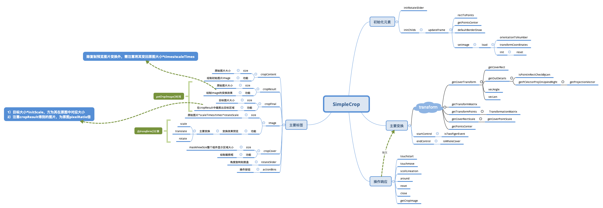

# simple-crop-uni

## 关于SimpleCrop

### 前言

这个组件来自[newbieYoung/Simple-Crop](https://github.com/newbieYoung/Simple-Crop), 此为改写的`uni app`H5端版本，借鉴自原组件的微信小程序版本。

### 使用

请见本项目示例。

props
| 属性 | 说明 | 类型 | 默认值 |
| ---- | ---- | ---- | ---- |
| src | 待裁剪图片 | String | '' |
| size | 输出图片目标大小 | Object | { width: 0, height: 0 }
| zIndex | 组件层级 | Number | 999 |
| positionOffset | 裁剪框屏幕偏移 | Object | { top: 0, left: 0 }
| borderWidth | 裁剪框边框宽度 | Number | 1 |
| borderColor | 裁剪框边框颜色 | String | '#ffffff' |
| boldCornerLen | 裁剪框边角加粗长度 | Number | 24 |
| coverColor | 遮罩背景颜色 | String | 'rgba(0,0,0,.3)' |
| cropSizePercent | 裁剪框占裁剪显示区域的比例 | Number | 0.9 |
| rotateSlider | 是否开启旋转刻度盘 | Boolean | true |
| startAngle | 旋转刻度盘开始角度，为负整数，若非负则为0 | Number | -90 |
| gapAngle | 旋转刻度盘间隔角度，>=3的正整数 | Number | 10 |
| endAngle | 旋转刻度盘结束角度，为正整数，若非正则为0，开始角度和结束角度之间存在大于0的整数个间隔 | Number | 90 |
| lineationItemWidth | 旋转刻度盘间隔宽度，最小为40.5 | Number | 40.5 |
| funcBtns | 功能按钮：取消、确认裁剪、整90度角旋转、还原 | Object | { 'close': true, 'crop': true, 'around': true, 'reset': true } |

events
| 事件名 | 说明 | 返回值 |
| ---- | ---- | ---- |
| on-close | 点击取消按钮 | 无 |
| on-crop-change | 确认裁剪 | { resultSrc: '' } |

### 当前存在问题

- 刻度盘初始位置显示错误，在整角旋转、还原时有同样问题（`scroll-view`未按`scroll-left`设定滚动至目标位置）
- “正在裁剪...”提示有时不显示

### 关系讲解图



### 关于uni的canvas组件H5端需要注意的

uni对于canvas在H5端的实现，做了大小重置，浏览器审查元素可以发现，设置的canvas style, 将应用在其外部的`uni-canvas`, 而内部实际的`canvas`的`width, height`，其数值为所设置大小的`SystemInfo.pixelRatio`倍，若未设置，则为默认的`300px, 150px`的`SystemInfo.pixelRatio`倍。因此，需要注意以下几点：

- 动态设置`canvas`的大小，应通过其`style`来实现，而不要直接获取`canvasEle`，用`canvasEle.width/height`设置
- canvas动态改变大小后，需延迟绘图，否则绘图内容可能不显示或一闪而过
- 绘制时，尺寸计算以设置的`style`为准
- a)`ctx = uni.createCanvasContext()` b)`ctx = canvasEle.getContext('2d')`,
  - a和b所得到的ctx，其所拥有的方法略有差异，前者有`ctx.draw()`, 后者则无此方法，具体以uni文档及H5canvas方法为准
  - `drawImage()`方法，其image参数定义，前者为imagePath, 后者则为Image对象，此为微信小程序与H5 canvas的差异
  - 前者在onReady中绘图，也需延迟并调用ctx.draw(); 在onLoad中绘图无效；其他时候绘图均需调用ctx.draw()
- `uni.canvasToTempFilePath()`得到的image的大小，为设置大小的`SystemInfo.pixelRatio`倍

相关链接：

- [uni 如何获取canvas并动态设置其宽高](https://ask.dcloud.net.cn/question/89547)
- [【报Bug】【紧急非常严重】canvas h5下绘制空白,一闪而过](https://ask.dcloud.net.cn/question/81675)

## Project setup

```bash
yarn install
```

### Compiles and hot-reloads for development

```bash
yarn serve
```

### Compiles and minifies for production

```bash
yarn build
```

### Customize configuration

See [Configuration Reference](https://cli.vuejs.org/config/).
